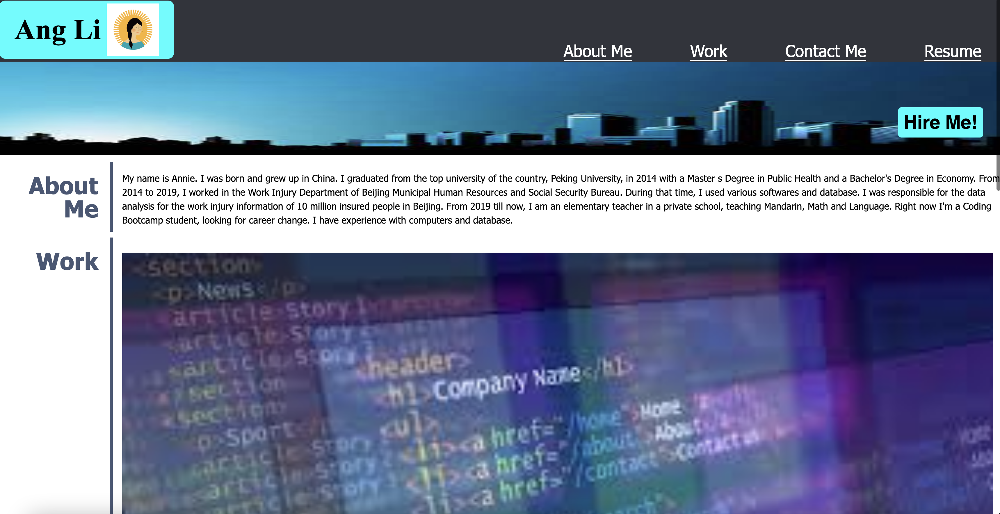
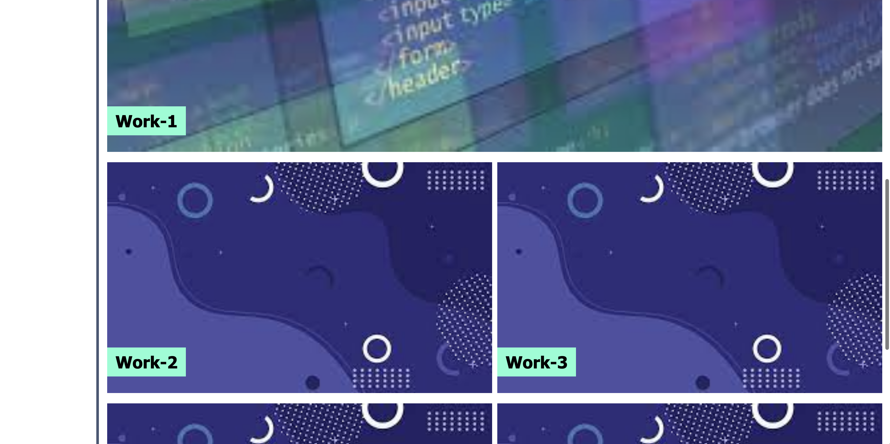
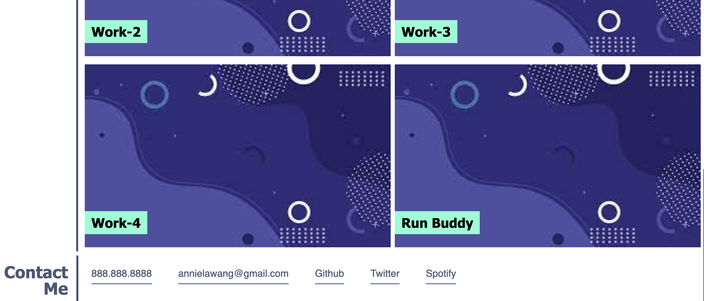
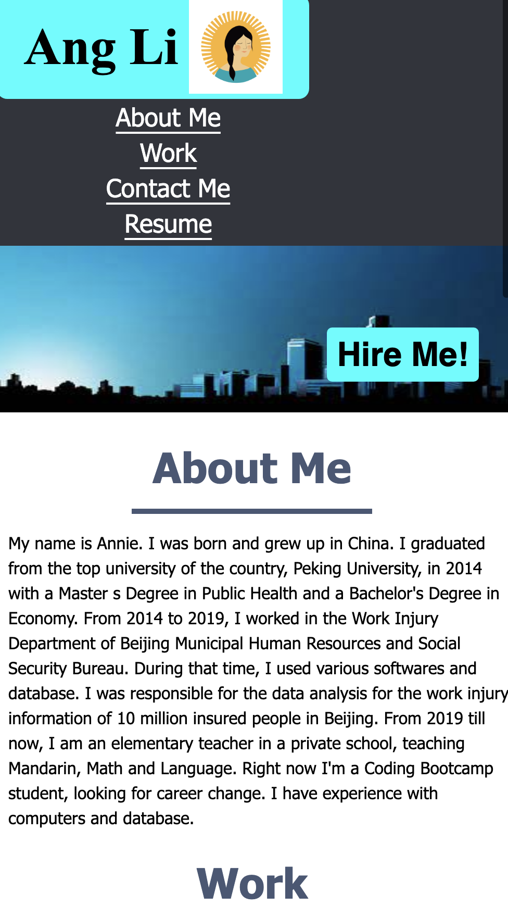
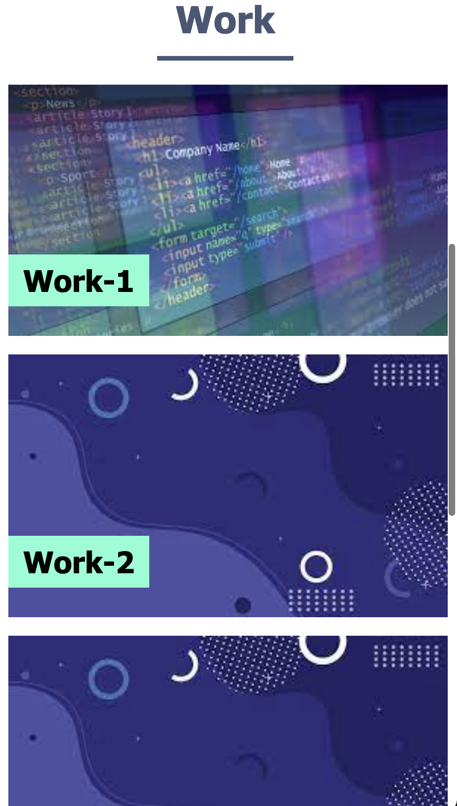
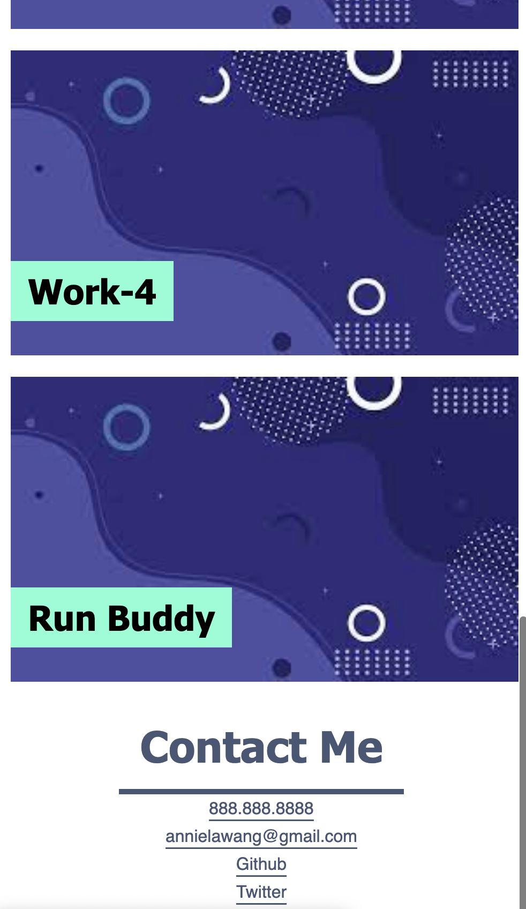

# 02-challenge-advanced-css
## Description
- What was your motivation?  
  To build a portfolio page for myself.
- Why did you build this project? (Note: the answer is not "Because it was a homework assignment.")  
  To put my personal information, work experience and projects in one place to showcase to potential employers.
- What problem does it solve?  
  Employers and I can easily access my information on a single web page.
- What did you learn?  
  I have learned to build a web page from scratch.
## Usage
Employers can go to the website and find my information in sections. By clicking on the links in navigation, they will be brought to relevant sections. By clicking on the images in relevant sections, they are guided to the web applications or other projects. You can access the link here: (https://annielawang.github.io/02-challenge-advanced-css/)

## Credits
Thank my teachers and classmates for their help. Thank my families for their support.
## License
MIT license.